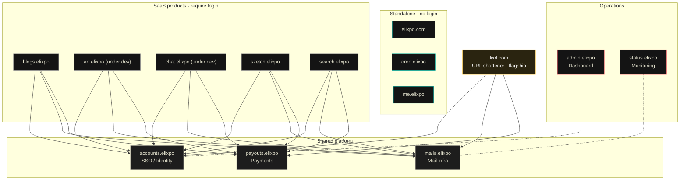

<p align="center">
  
</p>

<h1 align="center">Elixpo Admin</h1>

<p align="center">
  <strong>One calm place to see that everything Elixpo runs is healthy and online.</strong><br/>
  The internal control plane and Cloudflare observability dashboard for the Elixpo ecosystem.
</p>

<p align="center">
  <a href="https://admin.elixpo.com">admin.elixpo.com</a> ·
  <a href="https://github.com/orgs/elixpo/discussions">Discussions</a> ·
  <a href="https://github.com/elixpo/elixpo_chapter">Monorepo</a> ·
  <a href="https://github.com/sponsors/Circuit-Overtime">Sponsor</a>
</p>

---

## About

Elixpo is a family of apps that all share one account — your blog, your canvas,
your short links, your payments, and more. **Elixpo Admin is mission control:**
the single window the team uses to keep every one of those services fast,
healthy, and running, so you never have to think about it.

It auto-discovers every Pages project, Worker, D1, KV, Queue, Durable Object and
Workflow on the Elixpo Cloudflare account, surfaces full Cloudflare
observability, and ships a public status page. It quietly watches the whole
platform and shows, at a glance:

- 🟢 **What's up right now** — a live health check for every product.
- 📈 **How things are doing** — traffic, errors, and usage over time.
- 🌍 **Where people are** — visitors by country on an interactive globe.
- 🗂️ **Everything we run** — every app, database, and service, discovered
  automatically. Nothing is hidden, nothing is hand-maintained.

> This repository is the source for **admin.elixpo.com** — an internal, hosted
> dashboard. It is built with Next.js and runs on Cloudflare.

### The public status page

Anyone can check whether Elixpo is healthy — no login needed:

#### 👉 [admin.elixpo.com/status](https://admin.elixpo.com/status)

It shows a 90-day uptime history for the platform, the current status of each
product, and a feed of recent changes. If something's ever wrong, this is the
place to look.

### Who can get in?

The admin console itself is **invite-only** — only Elixpo team members marked as
admins can sign in (through the same Elixpo account you already use elsewhere).
Everyone else is welcomed at the door and pointed to the public status page or a
quick way to request access.

### Running this locally

```bash
npm install
npm run dev
```

Then open [http://localhost:3000](http://localhost:3000).

## The ecosystem

| Tool | What it does | Link |
| --- | --- | --- |
| 🎨 **Elixpo Art** | AI image generation _(under dev)_ | [art.elixpo.com](https://elixpo.com) |
| ✍️ **Elixpo Blogs** | A rich, modern writing and publishing space | [blogs.elixpo.com](https://blogs.elixpo.com) |
| 🖊️ **LixSketch** | A hand-drawn style whiteboard for ideas and diagrams | [sketch.elixpo.com](https://sketch.elixpo.com) |
| 💬 **Elixpo Chat** | A fluid, real-time AI chat experience _(under dev)_ | [chat.elixpo.com](https://chat.elixpo.com) |
| 🔎 **Elixpo Search** | Fast, AI-assisted search | [search.elixpo.com](https://search.elixpo.com) |
| 👤 **Elixpo Accounts** | One identity (SSO) across the ecosystem | [accounts.elixpo.com](https://accounts.elixpo.com) |
| 🔗 **lixrl** | Our flagship URL shortener | [lixrl.com](https://lixrl.com) |
| 🪪 **Portfolios** | Personal pages to showcase your work | [me.elixpo.com](https://me.elixpo.com) |
| 🐼 **Oreo** | The mascot's home | [oreo.elixpo.com](https://oreo.elixpo.com) |

Developers can drop our editors into their own projects with the
**`@elixpo/lixsketch`** and **`@elixpo/lixeditor`** packages, on npm and as VS
Code extensions.

## Architecture

Everything runs on **Cloudflare**. Three shared platform services back the
ecosystem, and products are either **SSO-backed SaaS**, **standalone**, or our
**flagship**:

- **`accounts.elixpo`** - single sign-on / identity
- **`mails.elixpo`** - shared mailing infrastructure
- **`payouts.elixpo`** - shared payments / payouts

SaaS products (Blogs, Art, Chat, Sketch, Search) and the flagship **lixrl.com**
all authenticate through Accounts (SSO) and share the Mail and Payouts infra.
The public, login-free surfaces (**elixpo.com**, **oreo.elixpo**, **me.elixpo**)
are standalone. **admin.elixpo** is the operations dashboard and
**status.elixpo** is monitoring.



A rendered, interactive version lives at **[elixpo.com/architecture](https://elixpo.com/architecture)**.

## Built by the community

Elixpo is made by people, in the open. **45+ contributors** have shaped these
tools, with a small core team steering the way:

- **Ayushman Bhattacharya** - Founder & Lead ([@Circuit-Overtime](https://github.com/Circuit-Overtime))
- **Vivek Yadav** - Lead Co-Dev ([@ez-vivek](https://github.com/ez-vivek))
- **Anwesha Chakraborty** - Core Maintainer ([@anwe-ch](https://github.com/anwe-ch))

Everyone is welcome. See **[CONTRIBUTING.md](CONTRIBUTING.md)** and our
**[Code of Conduct](CODE_OF_CONDUCT.md)**.

Every Elixpo service is open source. Spot a problem or have an idea? Open an
issue on the relevant project — each one links straight to its repository from
the status page.

- Changelogs: [gist.github.com/elixpoo](https://gist.github.com/elixpoo)
- Issues & code: [github.com/Circuit-Overtime](https://github.com/Circuit-Overtime)

## Recognition & programs

Elixpo has taken part in and been supported by **GSSOC**, **Hacktoberfest**,
**Pollinations.AI**, **MS Startup Foundations**, and **OSCI**.

## Get involved

- 💬 **Join the conversation** in [GitHub Discussions](https://github.com/orgs/elixpo/discussions).
- 🚀 **Submit your project** to be featured across the ecosystem.
- 🛠️ **Contribute** - browse good first issues in the [monorepo](https://github.com/elixpo/elixpo_chapter).
- ❤️ **Support us** via [GitHub Sponsors](https://github.com/sponsors/Circuit-Overtime).

## Brand assets

Brand-ready marks and per-service icons live under [`public/`](public/), and the
brand source of truth (mascot, palette, rules) lives in the main
[elixpo](https://github.com/elixpo/elixpo) repository. A browsable kit is at
**[elixpo.com/assets](https://elixpo.com/assets)**.

## License

Elixpo uses one **licensing standard** across every repository:

- **Code** - [MIT](LICENSES/preferred/MIT) (with the [Oreo-trademarks exception](LICENSES/exceptions/Oreo-trademarks)).
- **Brand & visual assets** - [CC-BY-4.0](LICENSES/preferred/CC-BY-4.0) (with the same exception).

The Oreo mascot, the chest E-badge, and the "Elixpo" and "Oreo" names, domains,
and palette are reserved - this protects the brand and its royalties while
keeping the code and assets free. See [`LICENSE`](LICENSE) and the per-product
notice board, [`NOTICE`](LICENSES/NOTICE).

## Exclusive

> Per-repo "exclusive" artifacts (an npm package, a VS Code extension, a hosted
> SaaS, a paid tier) are declared here and in [`NOTICE`](LICENSES/NOTICE).

**This repository:** None - it is the source for an internal, hosted admin
dashboard.

---

<p align="center"><sub>Made with care by the Elixpo team · © Elixpo</sub></p>
